# Longest Common Subsequence
Assume that you want find longest common subsequent string X in string Y

X = A C C G

Y = C C A G C A

Let create a matrix C as below – rows will be representing Y, and columns will be representing X
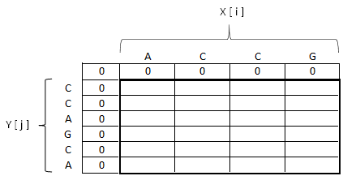 

Than consider each field of columns with each field of rows

If X [ i ] and Y [ j ] will be the same than increase field C [ i-1 ] [ j-1 ] and in the bracket append to end corresponding letter

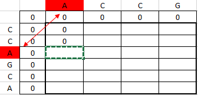 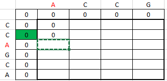 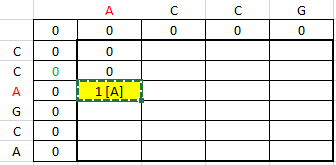

If not than takes bigger field C [ i-1 ] [ j ] or C [ i ] [ j-1 ] 

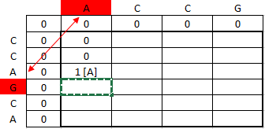 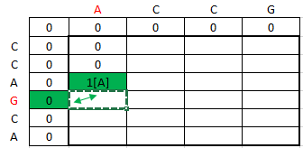 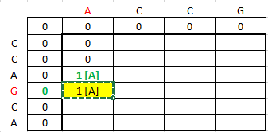

If X [ i ] and Y [ j ] will be not the same and fields C [ i-1 ] [ j ] or C [ i ] [ j-1 ]  will be have first number the same (for example 1 [ A ] and 1 [ C ]), takes C [ i ] [ j-1 ]

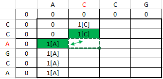 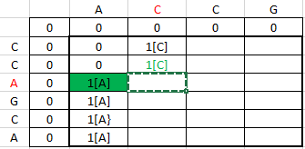 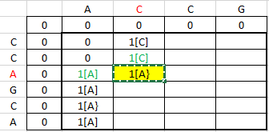

In the end we have outcome in the last filed of matrix C

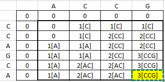

In this case the longest common subsequent this example has 3 litters CCG
